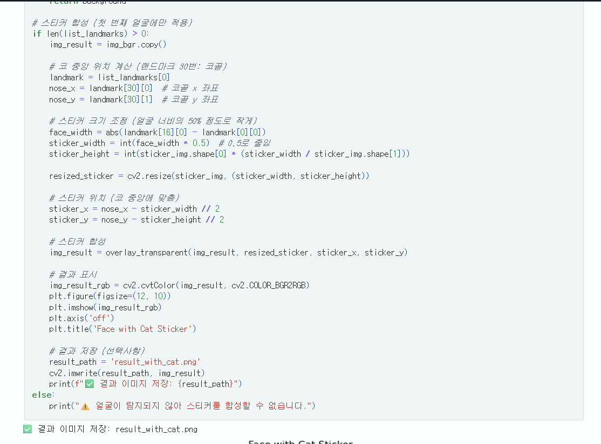
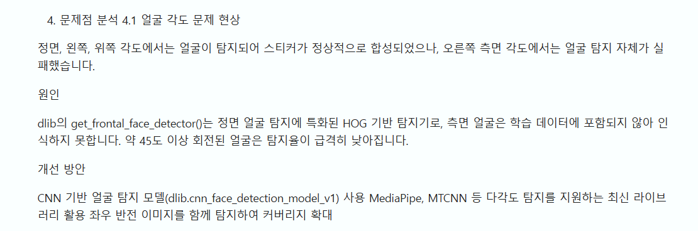

# AIFFEL Campus Online Code Peer Review Templete
- 코더 : 서인하
- 리뷰어 : 채세현


# PRT(Peer Review Template)
- [v]  **1. 주어진 문제를 해결하는 완성된 코드가 제출되었나요?**
    - 문제에서 요구하는 최종 결과물이 첨부되었는지 확인  
        - 중요! 해당 조건을 만족하는 부분을 캡쳐해 근거로 첨부  
        - 다양한 각도로 사진을 준비해 이모지를 합성한 점에서 주어진 문제를 해결하였다고 판단함  
        [이미지 결과물]("./source/img5.png)
    
- [v]  **2. 전체 코드에서 가장 핵심적이거나 가장 복잡하고 이해하기 어려운 부분에 작성된 
주석 또는 doc string을 보고 해당 코드가 잘 이해되었나요?**
    - 해당 코드 블럭을 왜 핵심적이라고 생각하는지 확인
    - 해당 코드 블럭에 doc string/annotation이 달려 있는지 확인
    - 해당 코드의 기능, 존재 이유, 작동 원리 등을 기술했는지 확인
    - 주석을 보고 코드 이해가 잘 되었는지 확인
        - 중요! 잘 작성되었다고 생각되는 부분을 캡쳐해 근거로 첨부

        - 스티커의 위치를 정하고 합성한 다음 결과를 출력하는 코드에서  
          각각의 단계를 주석으로 설명한 부분에서 가독성을 높였다고 판단함     
          
        
- [v]  **3. 에러가 난 부분을 디버깅하여 문제를 해결한 기록을 남겼거나
새로운 시도 또는 추가 실험을 수행해봤나요?**
    - 문제 원인 및 해결 과정을 잘 기록하였는지 확인
    - 프로젝트 평가 기준에 더해 추가적으로 수행한 나만의 시도, 
    실험이 기록되어 있는지 확인
        - 중요! 잘 작성되었다고 생각되는 부분을 캡쳐해 근거로 첨부
     
        - 정면, 좌우, 위를 바라보는 얼굴 이미지를 다양하게 준비해서 다양한 시도를 통해 문제를 해결한 부분에서 새로운 시도나 추가 실험을 수했다고 판단함
     
        - 문제점을 파악하고 개선 방안을 회고에 남김
         
        
- [v]  **4. 회고를 잘 작성했나요?**
    - 주어진 문제를 해결하는 완성된 코드 내지 프로젝트 결과물에 대해
    배운점과 아쉬운점, 느낀점 등이 기록되어 있는지 확인
    - 전체 코드 실행 플로우를 그래프로 그려서 이해를 돕고 있는지 확인
        - 중요! 잘 작성되었다고 생각되는 부분을 캡쳐해 근거로 첨부

          - 전체적인 실행 플로우는 작성되었다고 생각함 - 문제 해결을 위해 단계적으로 프로젝트를 구성한 부분에서 회고를 적절히 작성했다고 판단함
          - 하지만, 아쉬ㅏ운 부분은 각 단계를 시각적으로 자세히 보여주었으면 조금 더 좋았을 거 같다
            [프로젝트 회고]("./source/img4.png)
        
- [ ]  **5. 코드가 간결하고 효율적인가요?**
    - 파이썬 스타일 가이드 (PEP8) 를 준수하였는지 확인
    - 코드 중복을 최소화하고 범용적으로 사용할 수 있도록 함수화/모듈화했는지 확인
        - 중요! 잘 작성되었다고 생각되는 부분을 캡쳐해 근거로 첨부
        
        - 동일한 함수를 여러번 작성하고 img 주소 등 같은 변수를 여러번 작성한 점에서 코드 중복이 최소화하지 못했다고 생각함
        - 동일한 기능을 수행하는 코드가 많았기 때문에 모듈로 관리하는 것이 가능할 것으로 보임  
          [변수 중복 선언](./source/img1.png)
          [함수 중복 선언](./source/img2.png)
          [동일한 가능 조건문](./source/img3.png)  
        

# 회고(참고 링크 및 코드 개선)
```
# 리뷰어의 회고를 작성합니다.
# 코드 리뷰 시 참고한 링크가 있다면 링크와 간략한 설명을 첨부합니다.
# 코드 리뷰를 통해 개선한 코드가 있다면 코드와 간략한 설명을 첨부합니다.
```
