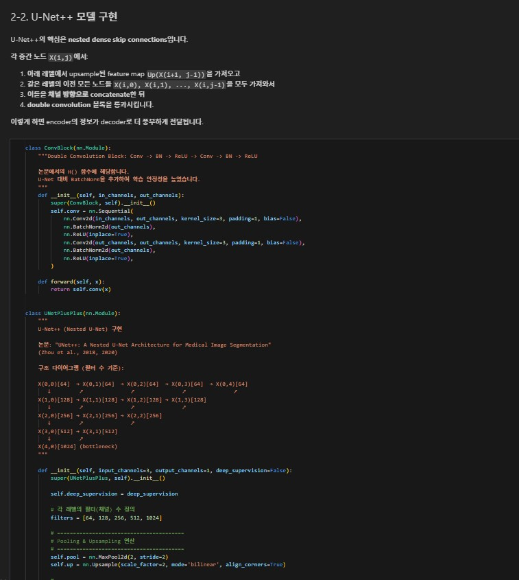
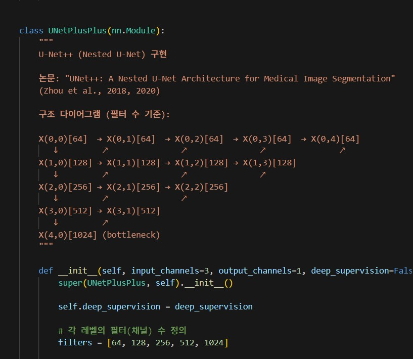
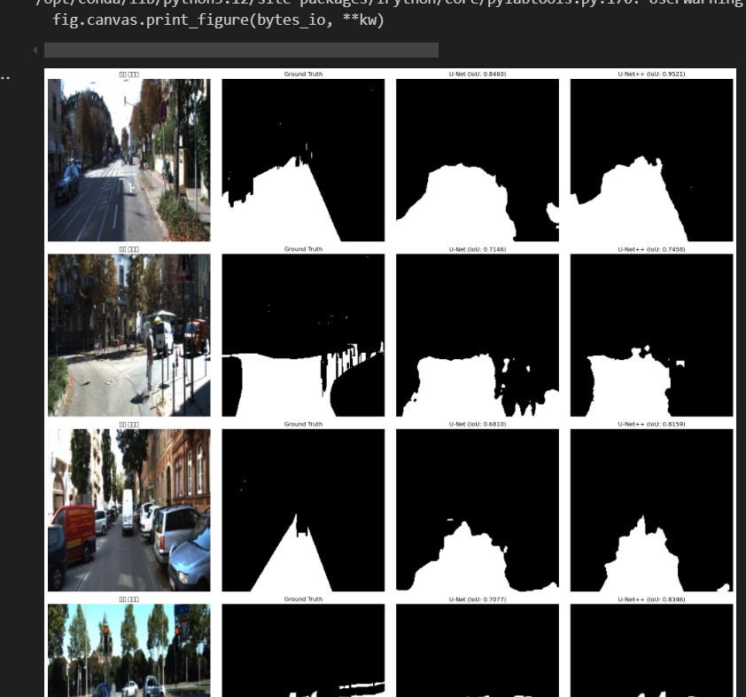
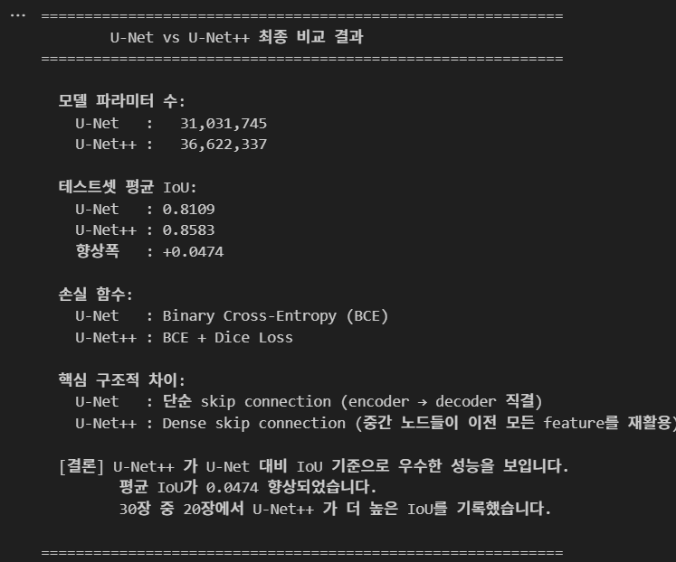
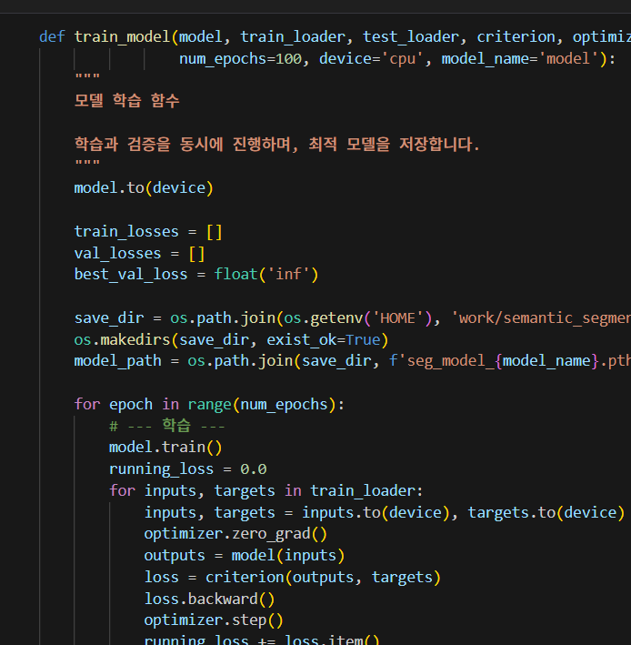

# AIFFEL Campus Online Code Peer Review Templete
- 코더 : 서인하
- 리뷰어 : 김태경


# PRT(Peer Review Template)
- [x]  **1. 주어진 문제를 해결하는 완성된 코드가 제출되었나요?**
    - 문제에서 요구하는 최종 결과물이 첨부되었는지 확인
        - 중요! 해당 조건을 만족하는 부분을 캡쳐해 근거로 첨부
    
    - 네 Unet++ 의 nested dense skip connection 모듈을 잘 구현하셨으며 Unet과 Unet++와의 비교도 잘 수행하셨습니다 !


    


- [x]  **2. 전체 코드에서 가장 핵심적이거나 가장 복잡하고 이해하기 어려운 부분에 작성된 
주석 또는 doc string을 보고 해당 코드가 잘 이해되었나요?**
    - 해당 코드 블럭을 왜 핵심적이라고 생각하는지 확인
    - 해당 코드 블럭에 doc string/annotation이 달려 있는지 확인
    - 해당 코드의 기능, 존재 이유, 작동 원리 등을 기술했는지 확인
    - 주석을 보고 코드 이해가 잘 되었는지 확인
        - 중요! 잘 작성되었다고 생각되는 부분을 캡쳐해 근거로 첨부


- 구조 다이어그램을 통해 전체 코드에서 각각의 채널의 변화나 아키텍처의 구성들을 정리하여 코드 이해가 쉽게 정리해주셨습니다 !!


    


- [x]  **3. 에러가 난 부분을 디버깅하여 문제를 해결한 기록을 남겼거나
새로운 시도 또는 추가 실험을 수행해봤나요?**
    - 문제 원인 및 해결 과정을 잘 기록하였는지 확인
    - 프로젝트 평가 기준에 더해 추가적으로 수행한 나만의 시도, 
    실험이 기록되어 있는지 확인
        - 중요! 잘 작성되었다고 생각되는 부분을 캡쳐해 근거로 첨부


- 정성적인 unet 과 Unet++를 비교하는 figure를 만들어주셔서 문제 해결과정과 
이번 노드의 목표를 잘 달성해주셨습니다 !

    



- [x]  **4. 회고를 잘 작성했나요?**
    - 주어진 문제를 해결하는 완성된 코드 내지 프로젝트 결과물에 대해
    배운점과 아쉬운점, 느낀점 등이 기록되어 있는지 확인
    - 전체 코드 실행 플로우를 그래프로 그려서 이해를 돕고 있는지 확인
        - 중요! 잘 작성되었다고 생각되는 부분을 캡쳐해 근거로 첨부


- 최종 결과 비교에 대해 잘 정리해주셨고, 결론을 잘 정리해주셨습니다.

- 


- [x]  **5. 코드가 간결하고 효율적인가요?**
    - 파이썬 스타일 가이드 (PEP8) 를 준수하였는지 확인
    - 코드 중복을 최소화하고 범용적으로 사용할 수 있도록 함수화/모듈화했는지 확인
        - 중요! 잘 작성되었다고 생각되는 부분을 캡쳐해 근거로 첨부

- 각각 모듈들을 함수화 하여 깔끔하게 사용하기 쉽게 정리해주셨습니다.

- 

# 회고(참고 링크 및 코드 개선)
```
두 모델들의 파라미터 비교와 함께 Unet, Unet++에서의 segmentation map 비교 시각화를 해주신 부분이 인상깊었습니다 ! 

덕분에 각 모델마다의 특징들과 어떤 부분들을 더 잘 포착하는지 확인해볼 수 있었습니다. 좋은 분석 감사합니다 !! 

```
